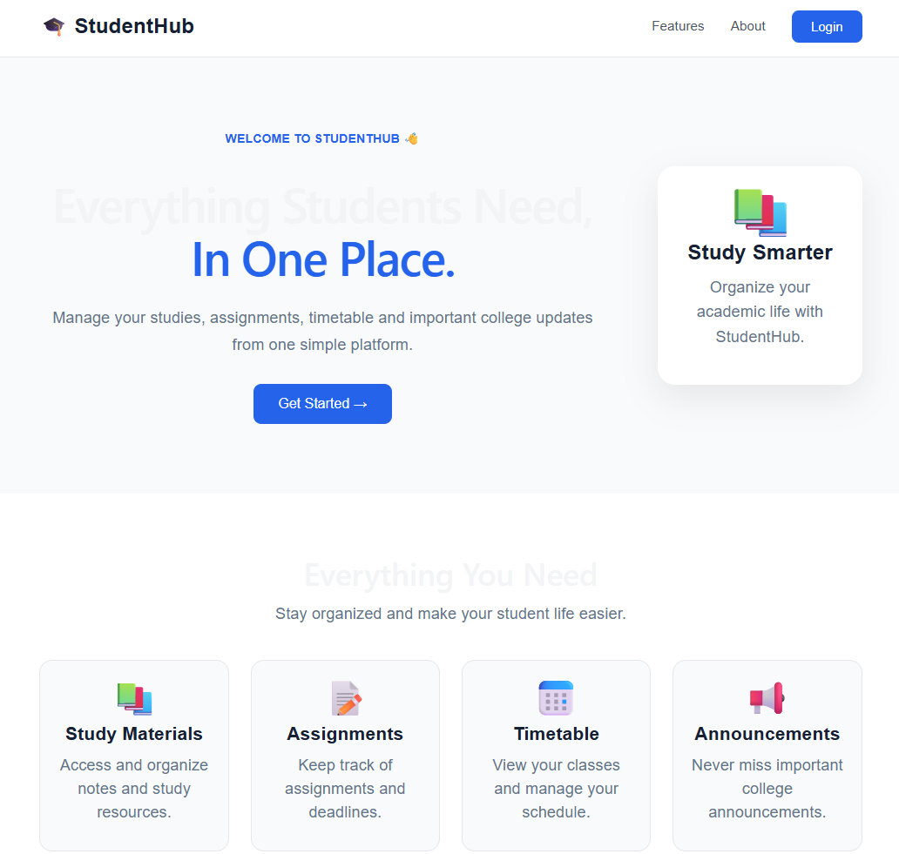
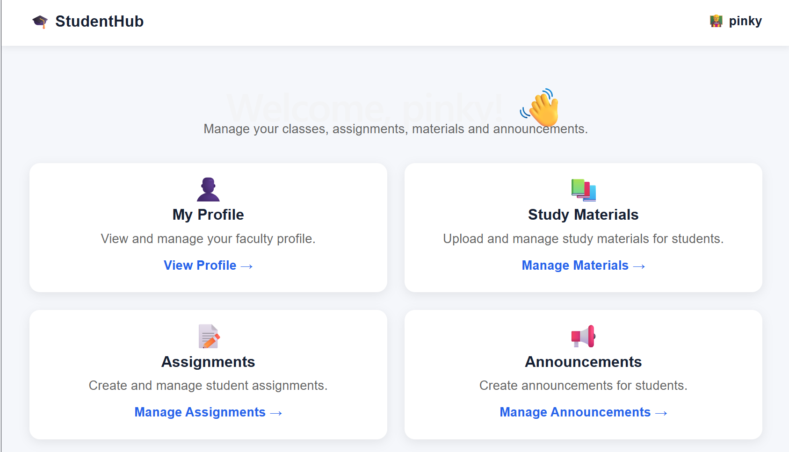
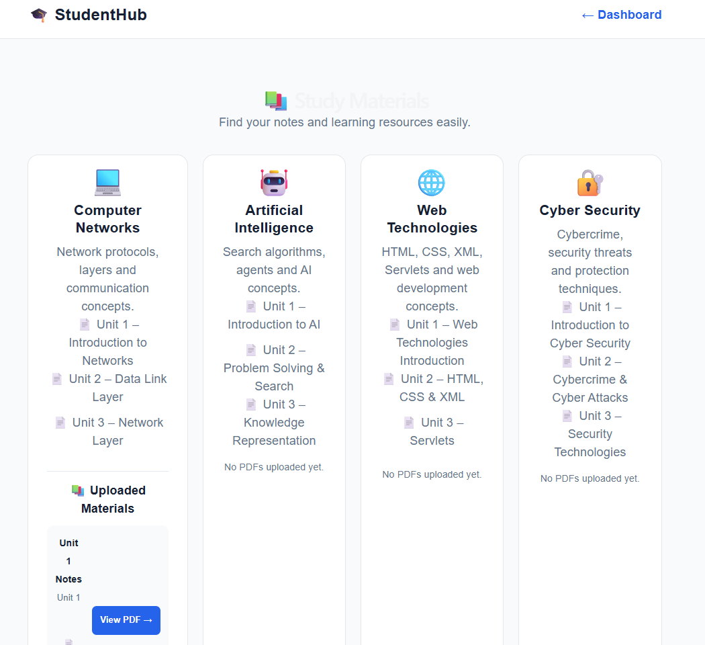

# 🎓 StudentHub

StudentHub is a full-stack student and faculty management portal designed to organize academic activities in one place.

## 🚀 Features

### 👨‍🎓 Student Features
- Student login and authentication
- Student profile management
- Study materials access
- Assignment tracking
- Timetable viewing
- College announcements
- Study progress overview

### 👨‍🏫 Faculty Features
- Faculty login
- Faculty profile management
- Upload and manage study materials
- Create and manage assignments
- Create and manage announcements
- Manage examinations
- View and manage academic information

## 🛠️ Technologies Used

### Frontend
- React.js
- Vite
- JavaScript
- HTML
- CSS

### Backend
- Node.js
- Express.js

### Database
- MongoDB
- Mongoose

### Other Tools
- Git
- GitHub
- REST API
- JWT / Authentication

## 📂 Project Structure

```text
StudentHub/
│
├── backend/
│   ├── models/
│   ├── routes/
│   ├── uploads/
│   ├── .env.example
│   └── server.js
│
├── public/
│   └── pdfs/
│
├── src/
│   ├── pages/
│   ├── assets/
│   ├── components/
│   └── App.jsx
│
├── .gitignore
├── package.json
├── README.md
└── vite.config.js
## 📸 Screenshots

### 🏠 Home Page


### 👨‍🎓 Student Dashboard


### 👨‍🏫 Faculty Dashboard


### 📝 Faculty Assignments


### 📝 Student Assignments


### 📚 Study Materials


### 📢 Announcements
